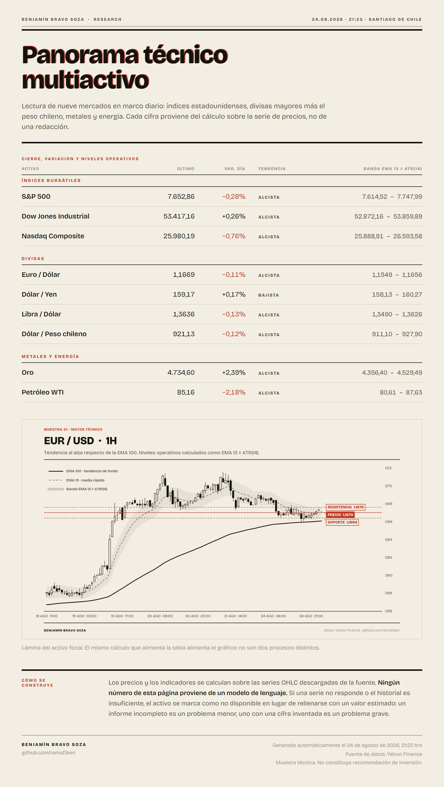
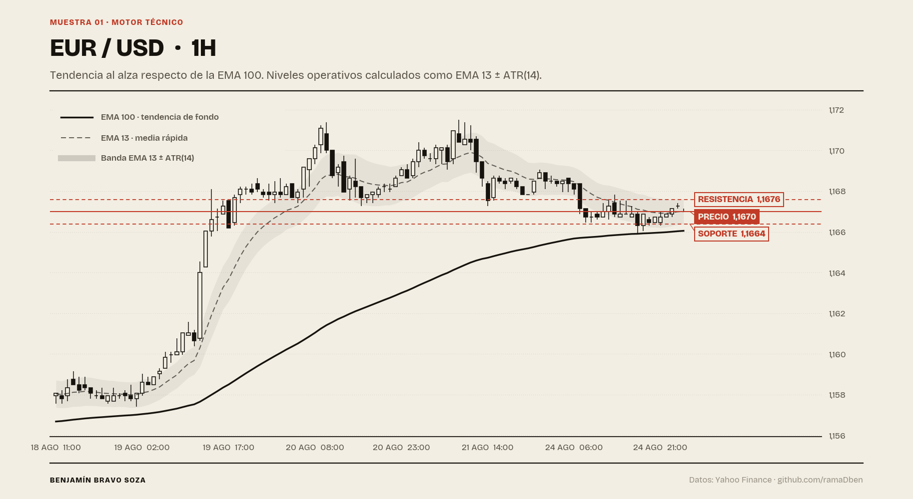
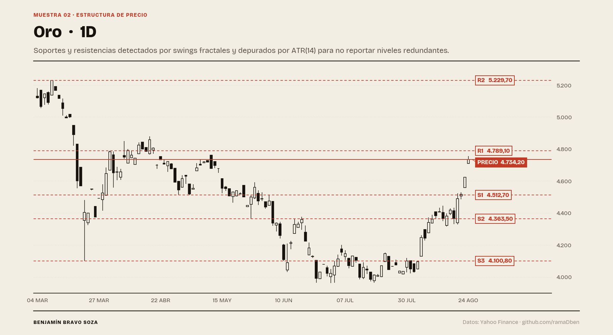
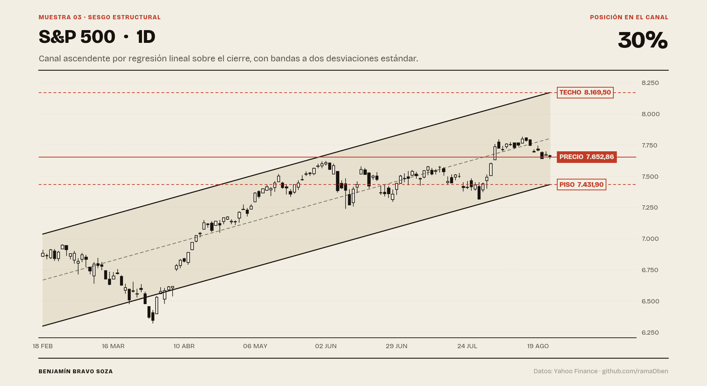

# Sistema de Research Macro Automatizado

> **Caso de estudio.** Este repositorio documenta la arquitectura y los resultados de un
> sistema en producción. **No contiene el código fuente**: la implementación es privada.
> Lo que encontrarás aquí es el problema que resuelve, cómo está construido y qué produce.

---

## El problema

Producir análisis de mercado diario es un trabajo que no escala bien a mano. Cada jornada
exige lo mismo: recolectar precios de varios activos, calcular niveles técnicos, cruzarlos
con datos macroeconómicos oficiales, revisar qué dijo la prensa financiera y sintetizar
todo en un informe legible antes de que abra el mercado.

Hecho manualmente son entre dos y tres horas diarias. Y tiene tres defectos que importan
más que el tiempo:

1. **No es reproducible.** Dos analistas con los mismos datos llegan a informes distintos,
   y ninguno puede reconstruir cómo llegó al de ayer.
2. **No es verificable.** Cuando una cifra sale mal, no hay forma de rastrear de dónde salió.
3. **No es escalable.** Cubrir más activos significa proporcionalmente más horas.

## La solución

Un pipeline que convierte ese proceso en una operación determinista y trazable.

```
   FUENTES DE DATOS              PROCESAMIENTO              SALIDA
   ─────────────────             ─────────────              ──────

   Terminal de mercado  ─┐
   (precios OHLC)        │
                         ├──►  Cálculo técnico    ─┐
   API Banco Central    ─┤     (EMA, ATR, niveles  │
   de Chile              │      dinámicos)         │
   (tasas, IPC, macro)   │                         ├──►  Informe diario
                         │                         │     verificado
   Calendario macro     ─┤     Orquestación de    ─┤     (HTML + PNG)
   (eventos y sorpresas) │     agentes de IA       │
                         │     (síntesis y         │     + mensaje de
   Prensa financiera    ─┘      verificación       │       distribución
   (fuentes acotadas)          cruzada)           ─┘
```

### Decisiones de diseño que vale la pena explicar

**Separación entre datos y narrativa.** Los números nunca los produce un modelo de
lenguaje. Los precios y los indicadores vienen del terminal de mercado y de las APIs de
datos oficiales; los agentes solo redactan sobre datos ya calculados. Esto elimina de raíz
el riesgo de que el sistema invente una cifra.

**Verificación cruzada antes de publicar.** Cada afirmación con contenido factual se
contrasta contra la fuente antes de entrar al informe. Lo que no se puede verificar, no se
publica.

**Contrato de error explícito.** Si una fuente no responde, el sistema devuelve un error
identificable, nunca un valor vacío ni un silencio. Un informe que no se genera es un
problema menor; un informe con un dato inventado es un problema grave.

**Salida pensada para el canal.** El informe se renderiza a resolución retina para que sea
legible en pantalla de teléfono, porque ahí es donde efectivamente se lee.

## Resultados

| | Antes | Después |
|---|---|---|
| Tiempo por informe | 2–3 horas | Minutos |
| Reproducibilidad | Ninguna | Total: mismo input, mismo output |
| Trazabilidad de cifras | Manual | Cada dato apunta a su fuente |
| Activos cubiertos | Limitado por horas | Limitado por cobertura de datos |

---

## Muestras de output

Las siguientes imágenes fueron generadas por el sistema sobre **datos públicos de
mercado** (Yahoo Finance), sin intervención manual. Todas las cifras que aparecen en ellas
están calculadas, no redactadas.

### Informe diario — panorama técnico multiactivo

Índices, divisas, metales y energía en una sola página: último precio, variación de la
sesión, tendencia respecto de la EMA 100 y banda dinámica EMA 13 ± ATR(14). Si una serie
no responde, el activo aparece marcado como no disponible en lugar de rellenarse.



### Motor técnico — niveles dinámicos

Media rápida EMA 13, tendencia de fondo EMA 100 y niveles operativos calculados como
EMA 13 ± ATR(14). El mismo cálculo alimenta la tabla del informe y el gráfico.



### Estructura de precio — soportes y resistencias automáticos

Detección de swings fractales sobre la serie OHLC, con deduplicación por ATR para que dos
niveles a distancia irrelevante no se reporten como si fueran distintos.



### Sesgo estructural — canal de regresión

Regresión lineal sobre el cierre con bandas a dos desviaciones estándar, y posición
relativa del precio dentro del canal.



<sub>Muestras técnicas de un sistema de generación automatizada de informes. No
constituyen recomendación de inversión.</sub>

---

## Stack

**Python** para el pipeline y la lógica de cálculo · **pandas / NumPy** para el tratamiento
de series · **APIs REST** para ingesta de datos oficiales · **MQL5** para la captura nativa
desde el terminal de mercado · **Orquestación de agentes de IA** para síntesis y
verificación · **Playwright** para el renderizado HTML a imagen.

## Por qué el código es privado

Este sistema no es una librería de propósito general: es metodología aplicada, construida
por iniciativa propia para resolver mi propio trabajo. La arquitectura la comparto con
gusto — de hecho está arriba. La implementación no, por la misma razón por la que un fondo
publica su tesis pero no su modelo.

Si estás evaluando mi trabajo y necesitas ver más, escríbeme y lo conversamos: puedo
mostrar el sistema funcionando en una llamada.

---

**Benjamín Bravo Soza** — Ingeniero Financiero · Analista de Mercados · Acreditado CMV

[linkedin.com/in/benjaminbravosoza](https://linkedin.com/in/benjaminbravosoza) · [github.com/ramaDben](https://github.com/ramaDben) · [benjamin.bravo@redieb.cl](mailto:benjamin.bravo@redieb.cl)
